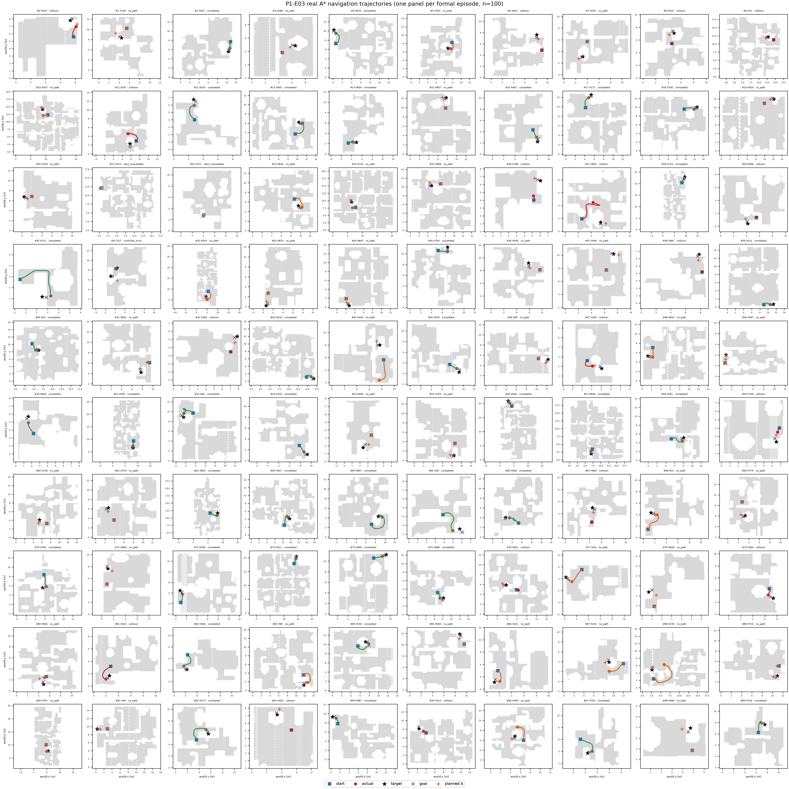

# Last-mile P1-E03 验收说明

**2026-09-23｜P1 协议完成；未启动 P2。**

冻结的 **100** 条正式样本均已分类，得到 **38** 个有效 nominal A；P2 gate 为 **open**。这只验收真实导航和状态交接，不评价抓取或 last-mile 效果。

## 结果

| 项目 | 实际结果 |
|---|---|
| 尝试/分类 | 100 / 100 |
| 有效 A | 38 |
| 终止分布 | `{"collision": 18, "completed": 38, "controller_error": 1, "no_path": 41, "scene_changed": 0, "start_unavailable": 2, "timeout": 0}` |
| P2 gate | `open`；本任务未启动 P2 |
| 正式批仿真 | 哈希与格式已审计；`formal_simulation=completed` |

图中每个面板对应一条正式样本。灰点是 0.30 m 安全半径下的可通行区域；线为控制器实际执行轨迹；方块、星号、叉号、加号分别表示远端起点、目标物体、导航采样目标和截断后的规划 A。颜色表示最终终止分类。观测单位为单个源目标实例；没有统计不确定度。

## 逐条审计

| # | house | 状态 | 策略步 | 终点 SE(2) 误差 | 详情 |
|---:|---:|---|---:|---:|---|
| 0 | 433 | `collision` | 39 | 1.6024 | collision |
| 1 | 749 | `no_path` | 32 | 3.4445 | failed_to_return_for_replan |
| 2 | 207 | `completed` | 38 | 0.0226 | all_waypoints_reached |
| 3 | 288 | `no_path` | 28 | 3.1370 | failed_to_return_for_replan |
| 4 | 676 | `completed` | 48 | 0.0230 | all_waypoints_reached |
| 5 | 765 | `no_path` | 57 | 0.1652 | failed_to_return_for_replan |
| 6 | 831 | `collision` | 5 | 2.7584 | collision |
| 7 | 155 | `no_path` | 29 | 4.2830 | failed_to_return_for_replan |
| 8 | 335 | `collision` | 8 | 3.2632 | collision |
| 9 | 15 | `collision` | 5 | 3.0612 | collision |
| 10 | 437 | `no_path` | 75 | 3.5061 | failed_to_return_for_replan |
| 11 | 247 | `collision` | 76 | 3.5182 | collision |
| 12 | 533 | `completed` | 45 | 0.0295 | all_waypoints_reached |
| 13 | 405 | `completed` | 83 | 0.0238 | all_waypoints_reached |
| 14 | 654 | `completed` | 13 | 0.0388 | all_waypoints_reached |
| 15 | 807 | `no_path` | 30 | 3.8989 | failed_to_return_for_replan |
| 16 | 467 | `completed` | 34 | 0.0209 | all_waypoints_reached |
| 17 | 171 | `completed` | 47 | 0.0283 | all_waypoints_reached |
| 18 | 706 | `completed` | 58 | 0.0261 | all_waypoints_reached |
| 19 | 420 | `no_path` | 39 | 3.3864 | failed_to_return_for_replan |
| 20 | 258 | `no_path` | 37 | 1.1118 | failed_to_return_for_replan |
| 21 | 153 | `start_unavailable` | 0 | — | non_plannable_goal |
| 22 | 271 | `start_unavailable` | 0 | — | no_collision_free_pose_in_goal_component |
| 23 | 626 | `no_path` | 85 | 0.3780 | failed_to_return_for_replan |
| 24 | 720 | `no_path` | 73 | 3.4007 | failed_to_return_for_replan |
| 25 | 669 | `no_path` | 30 | 3.3805 | failed_to_return_for_replan |
| 26 | 786 | `collision` | 20 | 3.4123 | collision |
| 27 | 803 | `collision` | 77 | 3.8337 | collision |
| 28 | 724 | `completed` | 40 | 0.0357 | all_waypoints_reached |
| 29 | 696 | `collision` | 3 | 3.3966 | collision |
| 30 | 721 | `completed` | 82 | 0.0251 | all_waypoints_reached |
| 31 | 17 | `controller_error` | 5 | 3.2768 | nonbase_joint_transient |
| 32 | 334 | `no_path` | 115 | 1.2771 | failed_to_return_for_replan |
| 33 | 633 | `no_path` | 31 | 2.2468 | failed_to_return_for_replan |
| 34 | 843 | `no_path` | 28 | 2.3823 | failed_to_return_for_replan |
| 35 | 704 | `completed` | 43 | 0.0261 | all_waypoints_reached |
| 36 | 546 | `no_path` | 23 | 2.0781 | failed_to_return_for_replan |
| 37 | 446 | `no_path` | 39 | 2.9927 | failed_to_return_for_replan |
| 38 | 887 | `collision` | 4 | 2.1649 | collision |
| 39 | 222 | `completed` | 33 | 0.0274 | all_waypoints_reached |
| 40 | 34 | `completed` | 47 | 0.0207 | all_waypoints_reached |
| 41 | 832 | `no_path` | 62 | 2.6105 | failed_to_return_for_replan |
| 42 | 490 | `collision` | 5 | 2.3024 | collision |
| 43 | 518 | `completed` | 38 | 0.0348 | all_waypoints_reached |
| 44 | 344 | `no_path` | 114 | 6.6542 | failed_to_return_for_replan |
| 45 | 679 | `completed` | 26 | 0.0287 | all_waypoints_reached |
| 46 | 83 | `no_path` | 31 | 2.7461 | failed_to_return_for_replan |
| 47 | 429 | `collision` | 39 | 0.5450 | collision |
| 48 | 643 | `no_path` | 82 | 0.3086 | failed_to_return_for_replan |
| 49 | 497 | `no_path` | 32 | 1.7812 | failed_to_return_for_replan |
| 50 | 828 | `completed` | 30 | 0.0243 | all_waypoints_reached |
| 51 | 783 | `completed` | 35 | 0.0219 | all_waypoints_reached |
| 52 | 60 | `completed` | 165 | 0.0241 | all_waypoints_reached |
| 53 | 310 | `completed` | 30 | 0.0354 | all_waypoints_reached |
| 54 | 496 | `no_path` | 25 | 1.3193 | failed_to_return_for_replan |
| 55 | 763 | `no_path` | 30 | 4.0667 | failed_to_return_for_replan |
| 56 | 566 | `completed` | 21 | 0.0112 | all_waypoints_reached |
| 57 | 848 | `completed` | 25 | 0.0268 | all_waypoints_reached |
| 58 | 501 | `completed` | 56 | 0.0263 | all_waypoints_reached |
| 59 | 746 | `collision` | 19 | 0.6322 | collision |
| 60 | 718 | `no_path` | 46 | 2.6055 | failed_to_return_for_replan |
| 61 | 379 | `no_path` | 30 | 2.7995 | failed_to_return_for_replan |
| 62 | 850 | `completed` | 45 | 0.0269 | all_waypoints_reached |
| 63 | 557 | `completed` | 43 | 0.0253 | all_waypoints_reached |
| 64 | 837 | `completed` | 87 | 0.0176 | all_waypoints_reached |
| 65 | 26 | `completed` | 55 | 0.0295 | all_waypoints_reached |
| 66 | 408 | `completed` | 99 | 0.0268 | all_waypoints_reached |
| 67 | 660 | `collision` | 5 | 1.9017 | collision |
| 68 | 13 | `no_path` | 87 | 0.5974 | failed_to_return_for_replan |
| 69 | 779 | `no_path` | 29 | 3.8253 | failed_to_return_for_replan |
| 70 | 795 | `completed` | 45 | 0.0187 | all_waypoints_reached |
| 71 | 666 | `no_path` | 37 | 2.4440 | failed_to_return_for_replan |
| 72 | 195 | `completed` | 36 | 0.0241 | all_waypoints_reached |
| 73 | 511 | `completed` | 38 | 0.0229 | all_waypoints_reached |
| 74 | 699 | `completed` | 31 | 0.0394 | all_waypoints_reached |
| 75 | 488 | `completed` | 37 | 0.0279 | all_waypoints_reached |
| 76 | 631 | `collision` | 12 | 3.4973 | collision |
| 77 | 29 | `no_path` | 78 | 0.8315 | failed_to_return_for_replan |
| 78 | 628 | `no_path` | 29 | 1.2119 | failed_to_return_for_replan |
| 79 | 264 | `collision` | 31 | 0.4112 | collision |
| 80 | 694 | `no_path` | 52 | 2.4297 | failed_to_return_for_replan |
| 81 | 542 | `collision` | 46 | 1.1491 | collision |
| 82 | 500 | `completed` | 52 | 0.0188 | all_waypoints_reached |
| 83 | 98 | `no_path` | 90 | 1.0132 | failed_to_return_for_replan |
| 84 | 534 | `completed` | 78 | 0.0364 | all_waypoints_reached |
| 85 | 584 | `no_path` | 35 | 2.1114 | failed_to_return_for_replan |
| 86 | 221 | `no_path` | 54 | 0.2530 | failed_to_return_for_replan |
| 87 | 232 | `no_path` | 97 | 3.5809 | failed_to_return_for_replan |
| 88 | 239 | `no_path` | 200 | 3.4595 | failed_to_return_for_replan |
| 89 | 715 | `no_path` | 58 | 3.6481 | failed_to_return_for_replan |
| 90 | 707 | `no_path` | 34 | 3.8022 | failed_to_return_for_replan |
| 91 | 94 | `no_path` | 38 | 1.7850 | failed_to_return_for_replan |
| 92 | 273 | `completed` | 70 | 0.0338 | all_waypoints_reached |
| 93 | 262 | `collision` | 13 | 3.4313 | collision |
| 94 | 487 | `completed` | 34 | 0.0250 | all_waypoints_reached |
| 95 | 414 | `collision` | 22 | 0.0668 | collision |
| 96 | 404 | `no_path` | 113 | 3.6338 | progress_stalled |
| 97 | 762 | `completed` | 60 | 0.0260 | all_waypoints_reached |
| 98 | 484 | `no_path` | 28 | 3.7196 | failed_to_return_for_replan |
| 99 | 740 | `completed` | 44 | 0.0334 | all_waypoints_reached |

每个 `completed` 都通过终点误差、非法碰撞、目标物体位移、非底盘关节漂移和 A 快照恢复检查。失败不补样，也不从分母中删除。完整输入、轨迹、事件、快照、逐条结果和完成标记位于 `/data0/wenyifan/MoMaTrajGen/.worktrees/last-mile-p0/eval_output/last_mile/p1_20260922/formal_E01`。

## 边界

- 本轮没有运行 IK、抓取或局部搜索。
- A* 的 0.8 m 是路径截断半径，不代表实际目标距离恰为 0.8 m。
- `COMPLETE.json` 只表示 100 条均有终止分类，不表示 100/100 导航成功。
- 当前资产环境仍是 P0 记录的本地版本；不声称复现其他资产版本。
