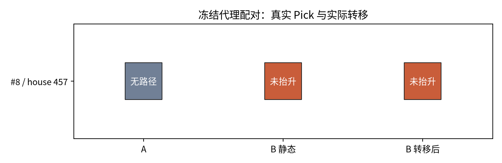

# Last-mile P4-E07 试点执行报告

**结论：试点的几何可行 B 已真实到达，但静态与转移后 Pick 均未成功；正式方向判定仍为证据不足。**

## 试点口径

冻结样本 10 条，有效 A 5 条，完整确定邻域 5 条。
代理站位救援 L_geo=1，可达救援 L_reach=1；I_reach=0.2，R_oracle=0.2。
unknown=0；按全部有效 A 的最保守/最乐观 I_reach 界限为 0.2–0.2。
P3 的 B* 在看真实 Pick 前选定；A/B 从同一快照独立恢复。无可执行见证路径按执行前规划失败计 0。

## 真实执行

A 成功 0/5；预选配对 1，已知配对 1。
配对四格 (A,B)：{'00': 1, '01': 0, '10': 0, '11': 0}；配对差 0.0；A 失败时 B 静态救援率 0.0。
转移尝试 1，到达 1；转移后成功 0；转移相对静态 B 差 0.0。

图 1：每行是一个冻结的源目标实例；灰色表示执行前无路径，橙色表示真实执行未通过严格 Pick，绿色表示成功。无误差棒，试点不做统计推断。

| 索引 | house | A 状态 | B* | B 静态 | 转移状态 | B 转移后 |
|---:|---:|---|---|---|---|---|
| 0 | 388 | skipped | — | — | — | — |
| 1 | 388 | skipped | — | — | — | — |
| 2 | 191 | planner_no_witness | — | — | — | — |
| 3 | 191 | planner_no_witness | — | — | — | — |
| 4 | 165 | skipped | — | — | — | — |
| 5 | 165 | planner_no_witness | — | — | — | — |
| 6 | 269 | planner_no_witness | — | — | — | — |
| 7 | 269 | skipped | — | — | — | — |
| 8 | 457 | planner_no_witness | G169 | insufficient_lift_or_drop | arrived | insufficient_lift_or_drop |
| 9 | 457 | skipped | — | — | — | — |

## 证据边界与下一步

真实执行成功必须满足双指接触、目标离开支撑并抬高至少 5 cm、连续稳定 1 s；闭爪至少 7 个 100 ms 步。
当前样本不计算 house 聚类区间，不套用正式 100 条继续/停止阈值；完整 Place、跨机器人复验均未运行。
若 B 静态成功但转移后失败，诊断转移误差、场景扰动和实际到达位姿重规划；若 B 静态失败，仅支持几何代理改善。

## 视觉检查和产物

配对状态图选中：一眼区分 A、静态 B 与转移后 B；简单漏斗拒绝：计数用正文更准确。
原始日志：`eval_output/last_mile/p4_20260923/E07_cuda5/episodes/NNN/trace.jsonl`；源数据：`metrics.json`、`episodes.jsonl`。
图源：`scripts/evaluation/plot_last_mile_p4.py`；图为 SVG/PNG，报告引用 PNG。

## 配对 #8 的机制诊断

P3 预选 B*=G169；当前可严格恢复的 P1-E04 模型上，B 同池同预算重新评价为 `feasible`。
闭爪实际等待 7 个 100 ms 步；末步指间距 0.0161 m；双指目标接触 0 个策略步；最大抬高 0.0047 m。
B 静态 Pick=`insufficient_lift_or_drop`；转移到达误差 0.0034807883263151718 m / 0.22247180693553723°；实际到达位姿重评价 `feasible`，Pick=`insufficient_lift_or_drop`。
这只能把失败定位到代理→真实夹持/抬升链；不能由单例推断普遍失效。

因果链：P3 的 F_geo(B)=1、静态走廊可达；P4 实际转移到达且在实际到达位姿重新评价仍可行；但真实夹爪没有形成持续双指持有，目标最大抬升远低于 5 cm。
本轮未预登记真实 Pick 成功率的数值预期，因此不把 0/1 写成事后阈值验证；它只把断点定位在几何代理之后的夹持/抬升阶段。

P1-E05_compat 的模型指纹目前无法在当前环境重建；本轮严格恢复 P1-E04，验证 A 数值与 P3 一致，并在该模型上对 B* 重新评价；没有直接执行跨模型旧 witness。
判定器的逻辑正负控制已通过；本轮无真实阳性，物理真阳性灵敏度仍未校准。
