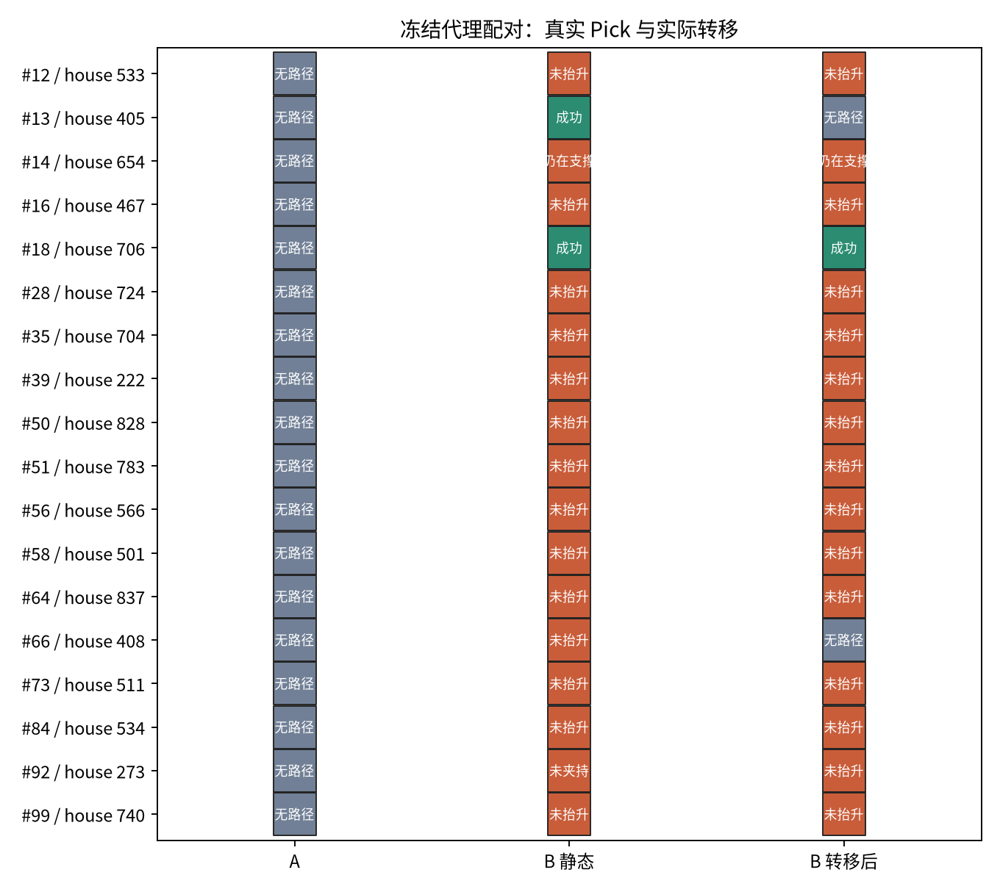

# Last-mile P4-formal-E01 正式批执行报告

**结论：无结论**（缺正式百例、有效 house 区间或严格 Pick 物理正负校准）

## 口径与漏斗

冻结清单 100 条，导航产生有效 A 38 条，具有确定 A 标签与完整确定邻域 N_eval=38 条。
A 第一次几何评价 not_found M=38；其中存在可行 B 的 L_geo=18，存在可达可行 B 的 L_reach=18。
I_geo=0.47368421052631576，I_reach=0.47368421052631576，R_oracle=0.47368421052631576；unknown=0，I_reach 的 最保守/最乐观界限 0.47368421052631576–0.47368421052631576。

## 执行层

A 侧得到确定 Pick 标签 38/38，成功 0 次；A 侧全部有效 A 的成功率界限 0.0–0.0。
A 侧状态分布：{'planner_no_witness': 38}。
预选配对 18，配对双方均有确定标签 18（转移后另有确定标签 18）。
配对四格 (A,B)：{'00': 16, '01': 2, '10': 0, '11': 0}；配对差 0.1111111111111111；A 失败时 B 静态救援率 0.1111111111111111。
转移尝试 18，到达 18（到达率 1.0）；转移后成功 1，转移相对静态 B 差 -0.05555555555555555。

图 1：每行一个冻结源目标实例，三列分别是 A、静态 B 与转移后 B 的真实 Pick 结果；颜色含义见正文与图例文字。

| 索引 | house | A 状态 | B* | B 静态 | 转移状态 | B 转移后 |
|---:|---:|---|---|---|---|---|
| 0 | 433 | skipped | — | — | — | — |
| 1 | 749 | skipped | — | — | — | — |
| 2 | 207 | planner_no_witness | — | — | — | — |
| 3 | 288 | skipped | — | — | — | — |
| 4 | 676 | planner_no_witness | — | — | — | — |
| 5 | 765 | skipped | — | — | — | — |
| 6 | 831 | skipped | — | — | — | — |
| 7 | 155 | skipped | — | — | — | — |
| 8 | 335 | skipped | — | — | — | — |
| 9 | 15 | skipped | — | — | — | — |
| 10 | 437 | skipped | — | — | — | — |
| 11 | 247 | skipped | — | — | — | — |
| 12 | 533 | planner_no_witness | G121 | insufficient_lift_or_drop | arrived | insufficient_lift_or_drop |
| 13 | 405 | planner_no_witness | G156 | success | arrived | planner_no_witness |
| 14 | 654 | planner_no_witness | G155 | support_contact | arrived | support_contact |
| 15 | 807 | skipped | — | — | — | — |
| 16 | 467 | planner_no_witness | G164 | insufficient_lift_or_drop | arrived | insufficient_lift_or_drop |
| 17 | 171 | planner_no_witness | — | — | — | — |
| 18 | 706 | planner_no_witness | G124 | success | arrived | success |
| 19 | 420 | skipped | — | — | — | — |
| 20 | 258 | skipped | — | — | — | — |
| 21 | 153 | skipped | — | — | — | — |
| 22 | 271 | skipped | — | — | — | — |
| 23 | 626 | skipped | — | — | — | — |
| 24 | 720 | skipped | — | — | — | — |
| 25 | 669 | skipped | — | — | — | — |
| 26 | 786 | skipped | — | — | — | — |
| 27 | 803 | skipped | — | — | — | — |
| 28 | 724 | planner_no_witness | G185 | insufficient_lift_or_drop | arrived | insufficient_lift_or_drop |
| 29 | 696 | skipped | — | — | — | — |
| 30 | 721 | planner_no_witness | — | — | — | — |
| 31 | 17 | skipped | — | — | — | — |
| 32 | 334 | skipped | — | — | — | — |
| 33 | 633 | skipped | — | — | — | — |
| 34 | 843 | skipped | — | — | — | — |
| 35 | 704 | planner_no_witness | G164 | insufficient_lift_or_drop | arrived | insufficient_lift_or_drop |
| 36 | 546 | skipped | — | — | — | — |
| 37 | 446 | skipped | — | — | — | — |
| 38 | 887 | skipped | — | — | — | — |
| 39 | 222 | planner_no_witness | G124 | insufficient_lift_or_drop | arrived | insufficient_lift_or_drop |
| 40 | 34 | planner_no_witness | — | — | — | — |
| 41 | 832 | skipped | — | — | — | — |
| 42 | 490 | skipped | — | — | — | — |
| 43 | 518 | planner_no_witness | — | — | — | — |
| 44 | 344 | skipped | — | — | — | — |
| 45 | 679 | planner_no_witness | — | — | — | — |
| 46 | 83 | skipped | — | — | — | — |
| 47 | 429 | skipped | — | — | — | — |
| 48 | 643 | skipped | — | — | — | — |
| 49 | 497 | skipped | — | — | — | — |
| 50 | 828 | planner_no_witness | G156 | insufficient_lift_or_drop | arrived | insufficient_lift_or_drop |
| 51 | 783 | planner_no_witness | G158 | insufficient_lift_or_drop | arrived | insufficient_lift_or_drop |
| 52 | 60 | planner_no_witness | — | — | — | — |
| 53 | 310 | planner_no_witness | — | — | — | — |
| 54 | 496 | skipped | — | — | — | — |
| 55 | 763 | skipped | — | — | — | — |
| 56 | 566 | planner_no_witness | G155 | insufficient_lift_or_drop | arrived | insufficient_lift_or_drop |
| 57 | 848 | planner_no_witness | — | — | — | — |
| 58 | 501 | planner_no_witness | G199 | insufficient_lift_or_drop | arrived | insufficient_lift_or_drop |
| 59 | 746 | skipped | — | — | — | — |
| 60 | 718 | skipped | — | — | — | — |
| 61 | 379 | skipped | — | — | — | — |
| 62 | 850 | planner_no_witness | — | — | — | — |
| 63 | 557 | planner_no_witness | — | — | — | — |
| 64 | 837 | planner_no_witness | G190 | insufficient_lift_or_drop | arrived | insufficient_lift_or_drop |
| 65 | 26 | planner_no_witness | — | — | — | — |
| 66 | 408 | planner_no_witness | G155 | insufficient_lift_or_drop | arrived | planner_no_witness |
| 67 | 660 | skipped | — | — | — | — |
| 68 | 13 | skipped | — | — | — | — |
| 69 | 779 | skipped | — | — | — | — |
| 70 | 795 | planner_no_witness | — | — | — | — |
| 71 | 666 | skipped | — | — | — | — |
| 72 | 195 | planner_no_witness | — | — | — | — |
| 73 | 511 | planner_no_witness | G190 | insufficient_lift_or_drop | arrived | insufficient_lift_or_drop |
| 74 | 699 | planner_no_witness | — | — | — | — |
| 75 | 488 | planner_no_witness | — | — | — | — |
| 76 | 631 | skipped | — | — | — | — |
| 77 | 29 | skipped | — | — | — | — |
| 78 | 628 | skipped | — | — | — | — |
| 79 | 264 | skipped | — | — | — | — |
| 80 | 694 | skipped | — | — | — | — |
| 81 | 542 | skipped | — | — | — | — |
| 82 | 500 | planner_no_witness | — | — | — | — |
| 83 | 98 | skipped | — | — | — | — |
| 84 | 534 | planner_no_witness | G158 | insufficient_lift_or_drop | arrived | insufficient_lift_or_drop |
| 85 | 584 | skipped | — | — | — | — |
| 86 | 221 | skipped | — | — | — | — |
| 87 | 232 | skipped | — | — | — | — |
| 88 | 239 | skipped | — | — | — | — |
| 89 | 715 | skipped | — | — | — | — |
| 90 | 707 | skipped | — | — | — | — |
| 91 | 94 | skipped | — | — | — | — |
| 92 | 273 | planner_no_witness | G120 | not_held_by_selected_gripper | arrived | insufficient_lift_or_drop |
| 93 | 262 | skipped | — | — | — | — |
| 94 | 487 | planner_no_witness | — | — | — | — |
| 95 | 414 | skipped | — | — | — | — |
| 96 | 404 | skipped | — | — | — | — |
| 97 | 762 | planner_no_witness | — | — | — | — |
| 98 | 484 | skipped | — | — | — | — |
| 99 | 740 | planner_no_witness | G120 | insufficient_lift_or_drop | arrived | insufficient_lift_or_drop |

## 预登记决策

house 聚类 bootstrap：I_reach 区间 [0.3157894736842105, 0.631578947368421]，配对差区间 [0.0, 0.2777777777777778]，出现救援的 house 数 18（重采样 2000 次）。
严格 Pick 物理正负校准：缺失；unknown 是否会改变方向判断：False。

## 证据边界

A 侧未出现真实夹持的原因必须在报告里与被评价器判定的几何可行性分开陈述：A 处动作链是否可执行，取决于 P1 的导航截断协议与冻结 torso，不能读成场景本身不可操作。
严格执行日志按 100 ms 记一行，非法接触与底盘漂移在每个 4 ms 步审计；无 witness 记作执行前规划失败，不等价于物理夹持失败。
原始日志：`eval_output/last_mile/p4_20260930/E01/episodes/NNN/trace.jsonl`；源数据：`metrics.json`、`episodes.jsonl`。
图源：`scripts/evaluation/plot_last_mile_p4.py`；图为 SVG/PNG，报告引用 PNG。

## 配对机制诊断 #12

P3 预选 B*=G121；B 同池同预算重新评价为 `feasible`。
闭爪实际等待 7 个 100 ms 步；末步指间距 0.0445 m；双指目标接触 6 个策略步；最大抬高 0.0471 m。
B 静态 Pick=`insufficient_lift_or_drop`；转移到达误差 5.4115368058437406e-05 m / 0.4277577852403616°；实际到达位姿重评价 `feasible`，Pick=`insufficient_lift_or_drop`。

## 配对机制诊断 #13

P3 预选 B*=G156；B 同池同预算重新评价为 `feasible`。
闭爪实际等待 7 个 100 ms 步；末步指间距 0.0349 m；双指目标接触 22 个策略步；最大抬高 0.0702 m。
B 静态 Pick=`success`；转移到达误差 0.0036118751694279297 m / 0.25478432892764247°；实际到达位姿重评价 `not_found`，Pick=`planner_no_witness`。

## 配对机制诊断 #14

P3 预选 B*=G155；B 同池同预算重新评价为 `feasible`。
闭爪实际等待 7 个 100 ms 步；末步指间距 0.0359 m；双指目标接触 11 个策略步；最大抬高 0.0558 m。
B 静态 Pick=`support_contact`；转移到达误差 0.00363988229360133 m / 0.5095455654140006°；实际到达位姿重评价 `feasible`，Pick=`support_contact`。

## 配对机制诊断 #16

P3 预选 B*=G164；B 同池同预算重新评价为 `feasible`。
闭爪实际等待 7 个 100 ms 步；末步指间距 0.0109 m；双指目标接触 1 个策略步；最大抬高 0.0480 m。
B 静态 Pick=`insufficient_lift_or_drop`；转移到达误差 0.0033710695164361672 m / 0.340242198387118°；实际到达位姿重评价 `feasible`，Pick=`insufficient_lift_or_drop`。

## 配对机制诊断 #18

P3 预选 B*=G124；B 同池同预算重新评价为 `feasible`。
闭爪实际等待 7 个 100 ms 步；末步指间距 0.0467 m；双指目标接触 21 个策略步；最大抬高 0.0517 m。
B 静态 Pick=`success`；转移到达误差 5.2999117090735984e-05 m / 0.5101840439619664°；实际到达位姿重评价 `feasible`，Pick=`success`。

## 配对机制诊断 #28

P3 预选 B*=G185；B 同池同预算重新评价为 `feasible`。
闭爪实际等待 7 个 100 ms 步；末步指间距 0.0116 m；双指目标接触 1 个策略步；最大抬高 0.0461 m。
B 静态 Pick=`insufficient_lift_or_drop`；转移到达误差 0.003477843283443792 m / 0.22185039069264384°；实际到达位姿重评价 `feasible`，Pick=`insufficient_lift_or_drop`。

## 配对机制诊断 #35

P3 预选 B*=G164；B 同池同预算重新评价为 `feasible`。
闭爪实际等待 7 个 100 ms 步；末步指间距 0.0188 m；双指目标接触 4 个策略步；最大抬高 0.0058 m。
B 静态 Pick=`insufficient_lift_or_drop`；转移到达误差 0.0033710699200566463 m / 0.3402426778196051°；实际到达位姿重评价 `feasible`，Pick=`insufficient_lift_or_drop`。

## 配对机制诊断 #39

P3 预选 B*=G124；B 同池同预算重新评价为 `feasible`。
闭爪实际等待 7 个 100 ms 步；末步指间距 0.0507 m；双指目标接触 23 个策略步；最大抬高 0.0513 m。
B 静态 Pick=`insufficient_lift_or_drop`；转移到达误差 5.290414259372109e-05 m / 0.5101840843960528°；实际到达位姿重评价 `feasible`，Pick=`insufficient_lift_or_drop`。

## 配对机制诊断 #50

P3 预选 B*=G156；B 同池同预算重新评价为 `feasible`。
闭爪实际等待 7 个 100 ms 步；末步指间距 0.0007 m；双指目标接触 0 个策略步；最大抬高 0.0000 m。
B 静态 Pick=`insufficient_lift_or_drop`；转移到达误差 0.0036114421230980936 m / 0.254788605885271°；实际到达位姿重评价 `feasible`，Pick=`insufficient_lift_or_drop`。

## 配对机制诊断 #51

P3 预选 B*=G158；B 同池同预算重新评价为 `feasible`。
闭爪实际等待 7 个 100 ms 步；末步指间距 0.0007 m；双指目标接触 0 个策略步；最大抬高 0.0006 m。
B 静态 Pick=`insufficient_lift_or_drop`；转移到达误差 0.003610213185247683 m / 0.25467767835707833°；实际到达位姿重评价 `feasible`，Pick=`insufficient_lift_or_drop`。

## 配对机制诊断 #56

P3 预选 B*=G155；B 同池同预算重新评价为 `feasible`。
闭爪实际等待 7 个 100 ms 步；末步指间距 0.0140 m；双指目标接触 0 个策略步；最大抬高 0.0189 m。
B 静态 Pick=`insufficient_lift_or_drop`；转移到达误差 0.003639843003758123 m / 0.509536258295432°；实际到达位姿重评价 `feasible`，Pick=`insufficient_lift_or_drop`。

## 配对机制诊断 #58

P3 预选 B*=G199；B 同池同预算重新评价为 `feasible`。
闭爪实际等待 7 个 100 ms 步；末步指间距 0.0110 m；双指目标接触 1 个策略步；最大抬高 0.0476 m。
B 静态 Pick=`insufficient_lift_or_drop`；转移到达误差 0.0034750954592430864 m / 0.22151857291721683°；实际到达位姿重评价 `feasible`，Pick=`insufficient_lift_or_drop`。

## 配对机制诊断 #64

P3 预选 B*=G190；B 同池同预算重新评价为 `feasible`。
闭爪实际等待 7 个 100 ms 步；末步指间距 0.0007 m；双指目标接触 0 个策略步；最大抬高 0.0181 m。
B 静态 Pick=`insufficient_lift_or_drop`；转移到达误差 0.0035760473320268814 m / 0.2544123910062225°；实际到达位姿重评价 `feasible`，Pick=`insufficient_lift_or_drop`。

## 配对机制诊断 #66

P3 预选 B*=G155；B 同池同预算重新评价为 `feasible`。
闭爪实际等待 7 个 100 ms 步；末步指间距 0.0089 m；双指目标接触 19 个策略步；最大抬高 0.0404 m。
B 静态 Pick=`insufficient_lift_or_drop`；转移到达误差 0.003639964645370231 m / 0.5095409376310638°；实际到达位姿重评价 `not_found`，Pick=`planner_no_witness`。

## 配对机制诊断 #73

P3 预选 B*=G190；B 同池同预算重新评价为 `feasible`。
闭爪实际等待 7 个 100 ms 步；末步指间距 0.0007 m；双指目标接触 0 个策略步；最大抬高 0.0000 m。
B 静态 Pick=`insufficient_lift_or_drop`；转移到达误差 0.003576052786492689 m / 0.2544127569555517°；实际到达位姿重评价 `feasible`，Pick=`insufficient_lift_or_drop`。

## 配对机制诊断 #84

P3 预选 B*=G158；B 同池同预算重新评价为 `feasible`。
闭爪实际等待 7 个 100 ms 步；末步指间距 0.0007 m；双指目标接触 0 个策略步；最大抬高 0.0008 m。
B 静态 Pick=`insufficient_lift_or_drop`；转移到达误差 0.0036105165186604044 m / 0.2546866711076629°；实际到达位姿重评价 `feasible`，Pick=`insufficient_lift_or_drop`。

## 配对机制诊断 #92

P3 预选 B*=G120；B 同池同预算重新评价为 `feasible`。
闭爪实际等待 7 个 100 ms 步；末步指间距 0.0227 m；双指目标接触 6 个策略步；最大抬高 0.0653 m。
B 静态 Pick=`not_held_by_selected_gripper`；转移到达误差 4.8800224388199706e-05 m / 0.510184404048541°；实际到达位姿重评价 `feasible`，Pick=`insufficient_lift_or_drop`。

## 配对机制诊断 #99

P3 预选 B*=G120；B 同池同预算重新评价为 `feasible`。
闭爪实际等待 7 个 100 ms 步；末步指间距 0.0476 m；双指目标接触 21 个策略步；最大抬高 0.0501 m。
B 静态 Pick=`insufficient_lift_or_drop`；转移到达误差 4.899786067573395e-05 m / 0.5101838040062143°；实际到达位姿重评价 `feasible`，Pick=`insufficient_lift_or_drop`。

## IK 限位 clip 修复后的重跑对照（人工补充）

上一轮（2026-09-29）暴露的 `_constrain_state` 限位 clip 伪影已修复：`MlSpacesKinematics._constrain_state()` 现在只 clip IK 解锁的 move group，锁定组逐位返回输入值。修复会改变 `feasibility.py` 依赖的 IK 行为，因此**另起目录**重跑（`eval_output/last_mile/p4_20260930/E01`），`run_p2/p3/p4` 的实现指纹也补上了 `molmo_spaces/kinematics/mujoco_kinematics.py`，避免旧目录静默混用两种 IK。

重跑结果：尝试 100 条、有效 A 38 条、配对 18 个；`I_reach`=0.474、配对四格 {'00': 16, '01': 2, '10': 0, '11': 0}、转移后成功 1 个。
决策：**无结论**（原因同上：配对执行改善区间下界为 0、缺物理校准），与上一轮一致 —— 该伪影不支配结论。

| 执行层观察 | 修复前（2026-09-29） | 修复后（2026-09-30） |
|---|---|---|
| B 静态 Pick 分布 | {'insufficient_lift_or_drop': 14, 'success': 2, 'support_contact': 1, 'not_held_by_selected_gripper': 1} | {'insufficient_lift_or_drop': 14, 'success': 2, 'support_contact': 1, 'not_held_by_selected_gripper': 1} |
| 转移后 replan 分布 | {'unknown': 11, 'not_found': 2, 'feasible': 5} | {'feasible': 16, 'not_found': 2} |
| B 转移后 Pick 分布 | {'planner_no_witness': 13, 'insufficient_lift_or_drop': 4, 'success': 1} | {'insufficient_lift_or_drop': 14, 'planner_no_witness': 2, 'support_contact': 1, 'success': 1} |

变化只在「转移后 replan」这一列：11 个 `unknown` 消失，变成与同一条目静态 B 完全相同的标签（`feasible` 16 / `not_found` 2），转移后的 Pick 状态也随之从 13 个伪 `planner_no_witness`变成真实的 `insufficient_lift_or_drop` 14 / `not_held_by_selected_gripper` 0 / `support_contact` 1 / `success` 1。也就是说：修复没有改变任何一次真实抓取的成败，只是把「因浮点夹回而无法规划」翻译成了它本来应有的评价结果。

关键执行数字（与上一轮一致）：转移全部到达 18/18，到位误差平移最大 0.00364 m、yaw 最大 0.51018°；违反协议的 trace 行 0 条、非法接触行 0 条。

剩余未做：P3/P2 的正式结果仍来自修复前的实现（`p3_20260923/formal_E01`、`p2_20260922/formal_E01`）。它们的结论不受该伪影影响（P3 的 unknown 点全部不可达、P2 无 unknown），但若要引用「同一实现下的完整证据链」，需在修复后的实现上新跑一轮 P3/P2。
