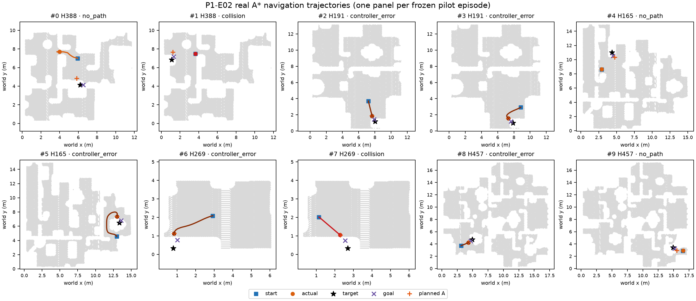

# Last-mile P1-E02 验收说明

**2026-09-22｜P1 协议完成；未启动 P2/P3/P4。**

冻结的 **10** 条试点均已分类，得到 **0** 个有效 nominal A；P2 gate 为 **closed**。这只验收真实导航和状态交接，不评价抓取或 last-mile 效果。

## 结果

| 项目 | 实际结果 |
|---|---|
| 尝试/分类 | 10 / 10 |
| 有效 A | 0 |
| 终止分布 | `{"collision": 2, "completed": 0, "controller_error": 5, "no_path": 3, "scene_changed": 0, "start_unavailable": 0, "timeout": 0}` |
| P2 gate | `closed`；本任务未启动 P2 |
| 正式 100 条 | 哈希与格式已审计；`formal_simulation=not_run` |

图中每个面板对应一条冻结试点。灰点是 0.30 m 安全半径下的可通行区域；线为控制器实际执行轨迹；方块、星号、叉号、加号分别表示远端起点、目标物体、导航采样目标和截断后的规划 A。颜色表示最终终止分类。观测单位为单个源目标实例；没有统计不确定度。

## 逐条审计

| # | house | 状态 | 策略步 | 终点 SE(2) 误差 | 详情 |
|---:|---:|---|---:|---:|---|
| 0 | 388 | `no_path` | 86 | 3.9816 | failed_to_return_for_replan |
| 1 | 388 | `collision` | 2 | 3.8497 | collision |
| 2 | 191 | `controller_error` | 33 | 0.0303 | nonbase_joint_drift |
| 3 | 191 | `controller_error` | 49 | 0.0368 | nonbase_joint_drift |
| 4 | 165 | `no_path` | 29 | 2.6665 | failed_to_return_for_replan |
| 5 | 165 | `controller_error` | 88 | 0.0213 | nonbase_joint_drift |
| 6 | 269 | `controller_error` | 31 | 0.0154 | nonbase_joint_drift |
| 7 | 269 | `collision` | 29 | 0.3499 | collision |
| 8 | 457 | `controller_error` | 24 | 0.0804 | nonbase_joint_transient |
| 9 | 457 | `no_path` | 27 | 1.2052 | failed_to_return_for_replan |

每个 `completed` 都通过终点误差、非法碰撞、目标物体位移、非底盘关节漂移和 A 快照恢复检查。本轮没有 `completed`，所以按协议没有生成 `A_snapshot.npz`。失败不补样，也不从分母中删除。完整输入、轨迹、事件、快照、逐条结果和完成标记位于 `/data0/wenyifan/MoMaTrajGen/.worktrees/last-mile-p0/eval_output/last_mile/p1_20260921/E02`。

## 边界

- 本轮没有运行 IK、抓取、局部搜索或正式 100 条仿真。
- A* 的 0.8 m 是路径截断半径，不代表实际目标距离恰为 0.8 m。
- `COMPLETE.json` 只表示 10 条均有终止分类，不表示 10/10 导航成功。
- 当前资产环境仍是 P0 记录的本地版本；不声称复现其他资产版本。
