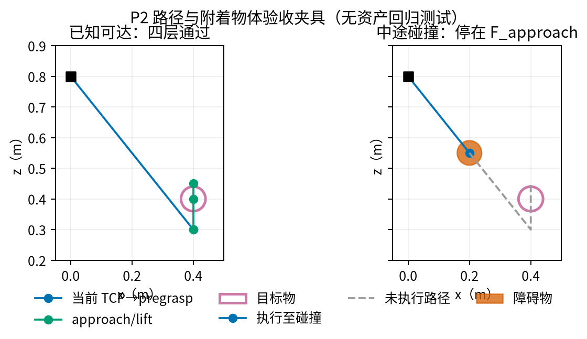

# Last-mile P2-E02 验收说明

**结论：P2 独立评价器已完成工程验收，可以进入 P3 局部站位扫描。** 当前 5 个有效 A
在冻结的有限搜索协议下均停在 `F_IK`；这不是“数学上不可达”，也不评价真实抓取成功率。

## 验收结果

| 项目 | 结果 |
|---|---|
| 回归测试 | **34 passed**（其中 P2 7 项） |
| P1 输入 | 合并夹爪伺服修复后重跑 E04；10 条中仍有 **5** 个有效 A |
| P2 实景输入 | 5 个有效 A，全部完成；`unknown=0` |
| 固定搜索量 | 每个 A：32 候选 × 2 臂 × 3 IK 初值 = **192 条链** |
| 重复性 | 每个 A 完整评价 2 次，结构化结果 **完全一致** |
| 分层结果 | `F_base` 5/5；存在 IK 链 0/5；approach 0/5；lift proxy 0/5 |
| 外部依赖 | CuRobo 未导入；LLM/API 未使用 |

图为无资产回归夹具的可视化复核：左侧是贯穿四层的已知正例；右侧是 TCP 到
pregrasp 途中与障碍碰撞的负例。它验证路径/接触判定，不是 P1 场景的效果证据。

## 覆盖与边界

- 已知可达、不达、初态碰撞、中途碰撞、附着目标碰撞及合法手指接触均有测试。
- IK 只解锁所选手臂；底盘、torso、另一手臂和夹爪逐位固定。
- 异常、超时、缺资产和数值错误归为 `unknown`；有限搜索耗尽归为 `not_found`。
- 抬升代理移动虚拟附着目标；正常或异常退出都会恢复 A 快照。

实景结果只说明：在“底盘和 torso 固定、每臂 3 初值、32 候选、IK 最多 300 次迭代”
的协议下，5 个 A 均未找到 pregrasp IK。P3 应保持同一协议扫描 B，不得只给 B 增加预算。
真实闭合、抬升和稳定持有仍留到 P4。

产物：`eval_output/last_mile/p2_20260922/E02/`。图源：
`scripts/evaluation/plot_last_mile_p2_acceptance.py`。

## 图的验收记录

| 候选图 | 决定 | 原因 |
|---|---|---|
| 正/负路径夹具 | 选中（诊断） | 复核合法接触、中途碰撞和附着抬升语义 |
| 5 个 A 的分层漏斗 | 拒绝 | 只有 `5→0→0→0`，表格更准确 |
| IK 残差图 | 拒绝 | 顺序 IK 失败时不暴露最终迭代状态，不能伪造残差 |
