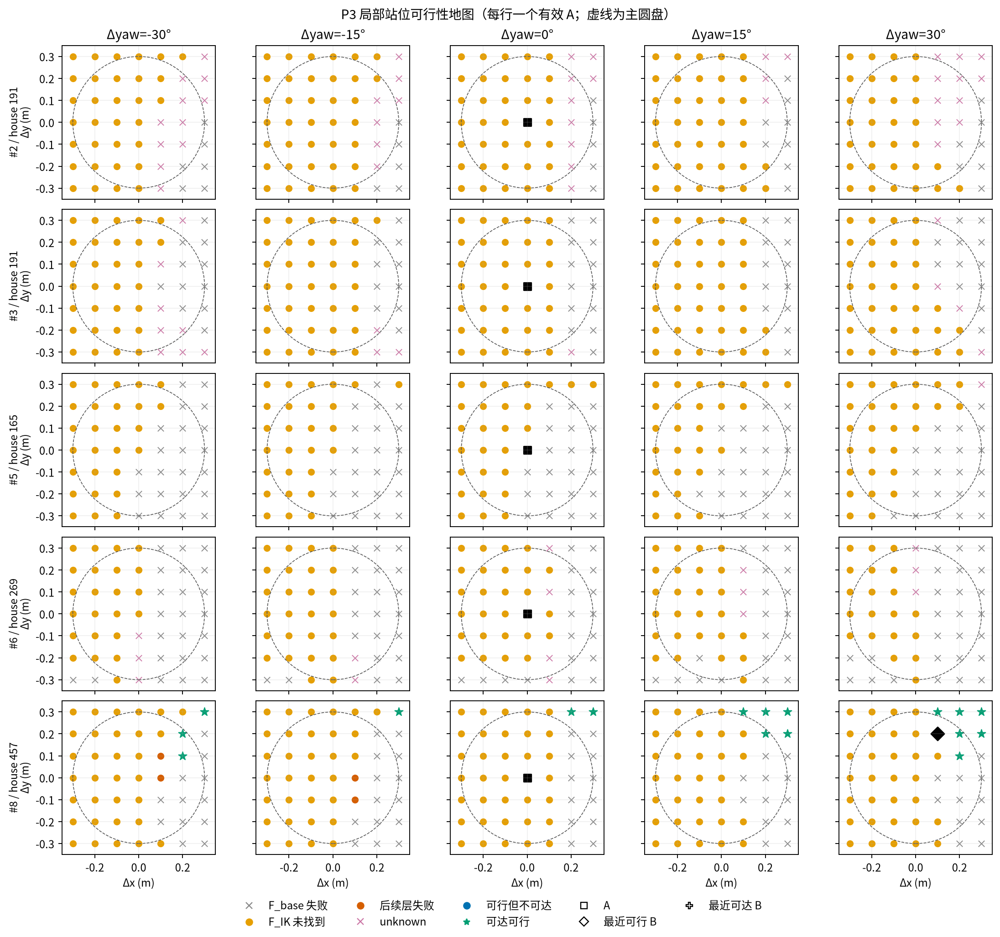
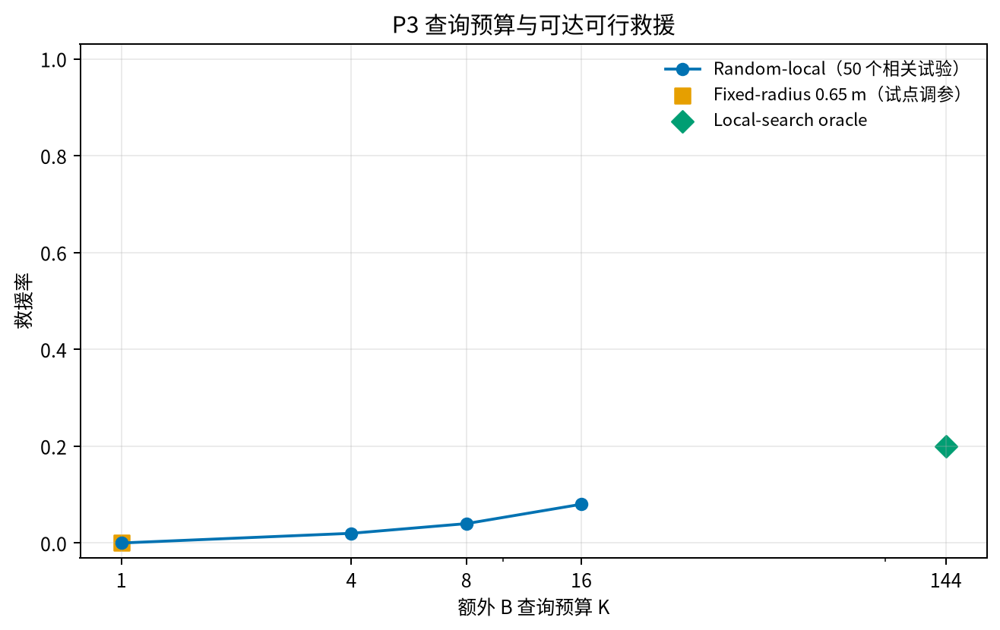

# Last-mile P3-E01 实验报告

**结论：试点观测到至少一个可达可行救援，可冻结协议后进入正式百例扫描。** 本轮只覆盖冻结的 10 条试点，其中 **5 条**有有效 A；不评价真实 Pick，也不把试点调参结果当成正式泛化证据。

## 问题、预期和受控变量

- 研究问题：普通导航终点 A 失败时，30 cm 圆盘内是否存在几何可行且静态走廊可达的 B？
- 实验编号：P3-E01。主要矛盾是 P2 的 5 个 A 全部停在 `F_IK`，局部底盘变化能否使同一有限搜索协议找到完整链。
- 运行前预期：5 个有效 A 中有 1–3 个可达救援；至少 1 个是进入正式扫描的试点信号。
- 唯一干预是底盘 SE(2)；抓取池、双臂、每臂 3 个初值、IK 迭代数、碰撞阈值和超时逐条继承 P2。

## 数据质量与充分性

- `N_attempt=10`，`N_nav=5`，完成完整地图 `5` 条；另有 `5` 条因 P1 无有效 A 跳过。
- 每个有效 A 有 245 个方形网格点、145 个主圆盘点；A 查询来自 P2 缓存，每条新增 244 个 B 查询。
- 方形全图状态：`{'feasible': 18, 'not_found': 1133, 'unknown': 74}`。本轮按 episode 计数，不把网格点或随机查询顺序当成独立场景。
- E04 的 A 快照模型指纹已无法由当前提交重建；因此用相同输入重放 E05_compat。五个有效 A 的索引和三维数值与 E04 **逐位完全相同**，没有绕过快照模型校验。

## Baseline / 预期 / 实际

| 量 | Baseline | 运行前预期 | 实际 |
|---|---:|---:|---:|
| A 的 `F_geo` 可行数 | 0/5 | 0/5 | 0/5（P2 缓存） |
| 圆盘内站位救援 `L_geo` | — | ≥1/5 | 1/5 |
| 圆盘内可达救援 `L_reach` | — | 1–3/5 | 1/5；unknown 上界 1/5 |
| Oracle 救援率 | 0 | >0 | 0.2 |

图 1：每行是一个源目标实例，每列固定一个相对 yaw。圆盘虚线为主要统计区域；点是协议内站位标签。网格点相关，不表示独立样本；本图没有统计误差棒。

## 公平预算基线

| 方法 | K | 观测救援 | unknown 最乐观上界 |
|---|---:|---:|---:|
| Nav-only | 0 | 0/5 | 0/5 |
| Random-local | 1 | 0/50 (0.000) | 0/50 (0.000) |
| Random-local | 4 | 1/50 (0.020) | 1/50 (0.020) |
| Random-local | 8 | 2/50 (0.040) | 2/50 (0.040) |
| Random-local | 16 | 4/50 (0.080) | 4/50 (0.080) |
| Fixed-radius（0.65 m） | 1 | 0/5 | 0/5 |
| Oracle | 144 | 1/5 | 1/5 |

图 2：Random-local 每个 episode 有 10 个确定性顺序，共 50 个相关试验；曲线仅作描述。Fixed-radius 使用同一试点选择距离，因此不是无偏测试结果。Oracle 是有限圆盘网格上限。

## 逐条追溯

| # | house | P1 或 P3 状态 | 地图点 | 最近可行 B | 最近可达 B |
|---:|---:|---|---:|---|---|
| 0 | 388 | `no_path` | 跳过 | — | — |
| 1 | 388 | `collision` | 跳过 | — | — |
| 2 | 191 | `completed` | 245 | — | — |
| 3 | 191 | `completed` | 245 | — | — |
| 4 | 165 | `no_path` | 跳过 | — | — |
| 5 | 165 | `completed` | 245 | — | — |
| 6 | 269 | `completed` | 245 | — | — |
| 7 | 269 | `collision` | 跳过 | — | — |
| 8 | 457 | `completed` | 245 | G169 | G169 |
| 9 | 457 | `no_path` | 跳过 | — | — |

## 机制、偏差和不确定度

- 机制成立需要看到某些 B 的 `F_IK` 及后续层由 0 变为正，并且 `C(A,B)` 通过。地图中的分层状态用于定位断点，不用真实执行结果挑 B。
- `not_found` 只表示 32×2×3 的有限协议未找到链，不是数学不可达。离散路径检查也不能证明连续无碰撞。
- 只有 5 个有效 A，且来自 4 个 houses；不计算伪精确的 house bootstrap 区间。`I_reach=0.2`，最乐观 unknown 上界为 `0.2`。
- 当前没有执行闭合、抬升或 A→B 转移；即使代理改善，也不能声明真实 Pick 得到改善。

## 收敛记录与判定

- 运行前仍活着的解释：A 只是局部站位不佳；或固定 torso/有限 IK 覆盖下整个邻域都找不到链。
- 运行后以地图的分层变化区分两者；unknown 是否改变方向：`False`。
- 实验价值：**有信息**。方向判定：**继续**。生命周期建议：**不动**。
- 暂存问题：真实 Pick、真实 A→B 转移和正式 100 条均未运行，不自动进入 P4。

## 图与产物验收

| 候选图 | 决定 | 原因 | 保留 |
|---|---|---|---|
| 固定 yaw 可行性地图 | 选中（证据） | 展示分层失败、A/B 和空间结构 | 随本运行保留 |
| 查询预算—救援率 | 选中（证据） | 直接对应公平预算比较 | 随本运行保留 |
| 10→5 的简单漏斗 | 拒绝 | 两个数字用表格更准确 | — |
| P4 配对执行图 | 拒绝 | 本轮没有真实 Pick 数据 | — |

源数据：`eval_output/last_mile/p3_20260922/E01/candidates.jsonl`、`metrics.json`。图源：`scripts/evaluation/plot_last_mile_p3.py`，并保留 SVG/PNG。`COMPLETE.json` 只表示扫描和分类完整。
